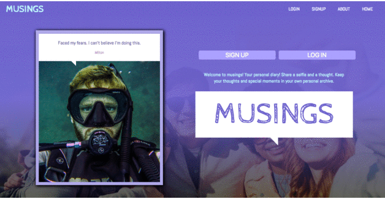

# MUSINGS: A SOCIAL MEDIA SITE
[VISIT MUSINGS!](https://musings1.herokuapp.com/)

### DESCRIPTION
Musings is a photo & microblogging site and your own personal visual diary!

The project: To build a fully functional social media site with functionality for users to sign-up, log-in, create and delete posts and their account.

### CONCEPT AND DESIGN
Musings incorporates all the elements of a popular social media site; it allows users to easily contribute, has content that is visual and easy to follow, and it leans on content that is already familiar and popular among social media users.

The css and framework is built from scratch! The site is made to look simple and ready-to-use.

Motif: This site uses a speech bubble motif that is used throughout the site, from login forms, to posts, and even delete prompts!

### LANGUAGES & TOOLS USED
HTML, CSS, JavaScript, RUBY, Sinatra, SQLite, ActiveRecord

### RESOURCES

For this project, the following resources and frameworks were utilized in building the site:

- [Animate CSS](https://daneden.github.io/animate.css/): tool for simple site animations
- [Font Awesome](https://fontawesome.com/icons?d=gallery): specialized icons!
- [Google Fonts](https://fonts.google.com/): Free modern fonts!

## CREDITS
Karl Rodulfo
